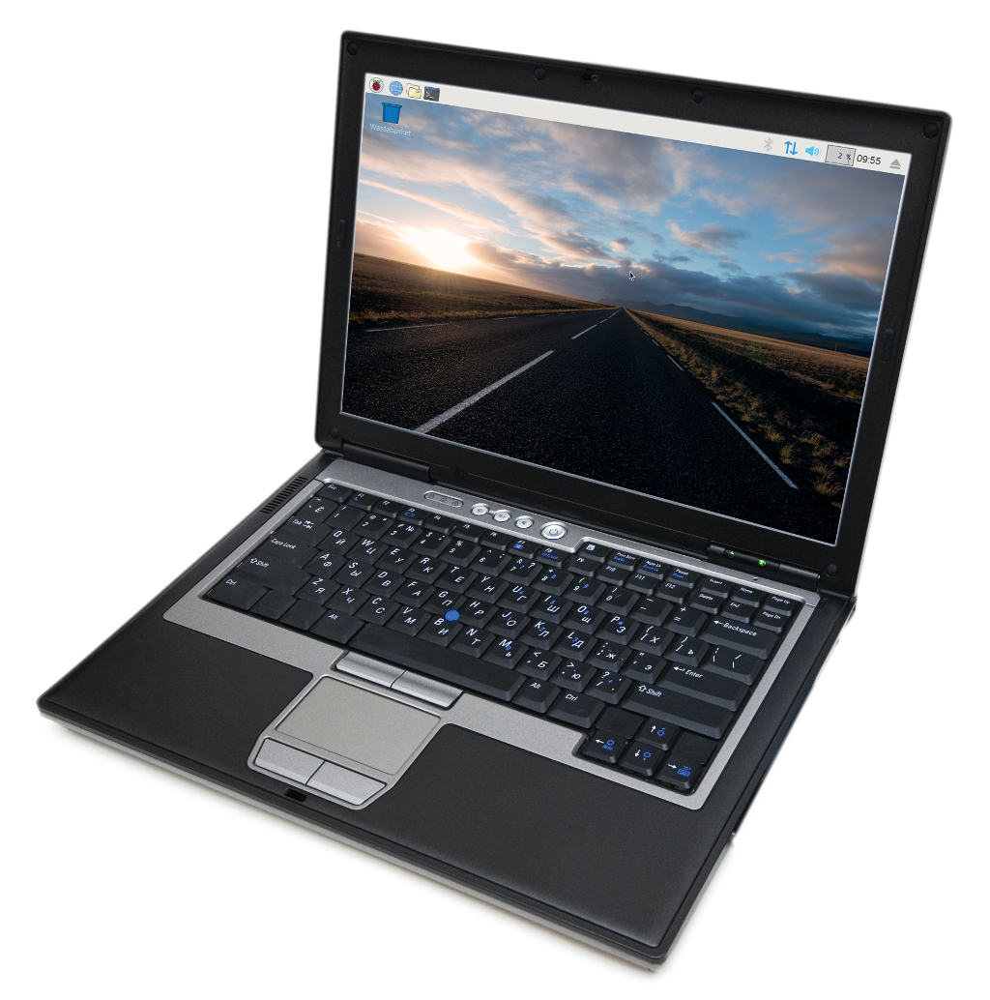

## Introduction

You will learn how to install the Raspberry Pi Desktop on a PC or Apple Mac to get the Raspberry Pi experience on your laptop or desktop computer.

Running the Raspberry Pi Desktop is a great way to recycle old hardware that's no longer capable of running the latest version of Windows or macOS.

It also comes pre-installed with lots of software tools to get you started with coding and digital making.

**Warning:** installing Raspberry Pi Desktop on a computer will delete all the data on it. Be sure to back up anything you need before you go any further.

--- collapse ---

---
title: What you will need
---

### Hardware

+ A USB drive (8GB or more)
+ A computer to create the USB drive installer
+ A computer to install the Raspberry Pi Desktop on

**Note: you can use one computer to do both.** It's possible to create the installer using one computer, and then install the Raspberry Pi Desktop on this computer using the installer.

### Software

+ [Raspberry Pi Desktop installation](https://www.raspberrypi.org/downloads/raspberry-pi-desktop/)
+ [Etcher](https://etcher.io/)

--- /collapse ---

If you need to print this project, please use the [printer-friendly version](https://projects.raspberrypi.org/en/projects/project-name/print){:target="_blank"}.
