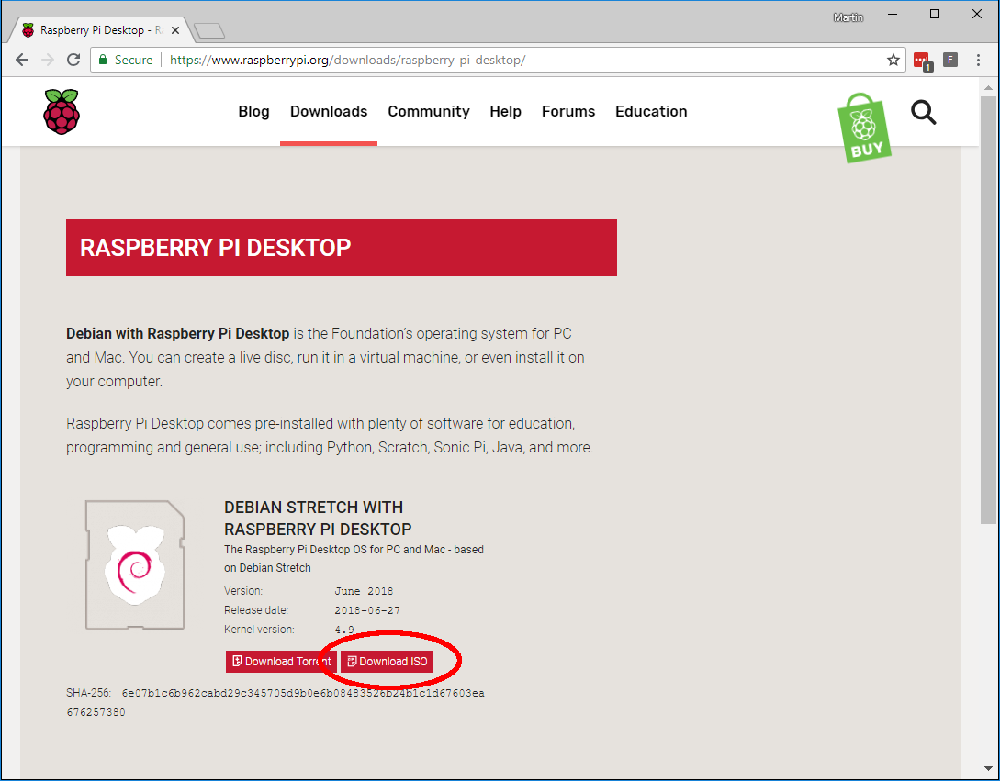

## Download the Raspberry Pi Desktop installation 

+ Download the latest version of the [Raspberry Pi Desktop installation](https://www.raspberrypi.org/downloads/raspberry-pi-desktop/) from the Raspberry Pi website.

**Note:** the download may take a long time because the file is large. We therefore recommend that using a high-speed internet connection.

**Note:** since you'll download the latest version, it might be different to the one shown in the image above.*

+ Save the **.iso** installation file somewhere on your computer. Remember where you saved it, as you will need it in the next step.
