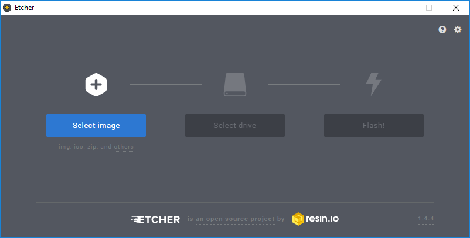
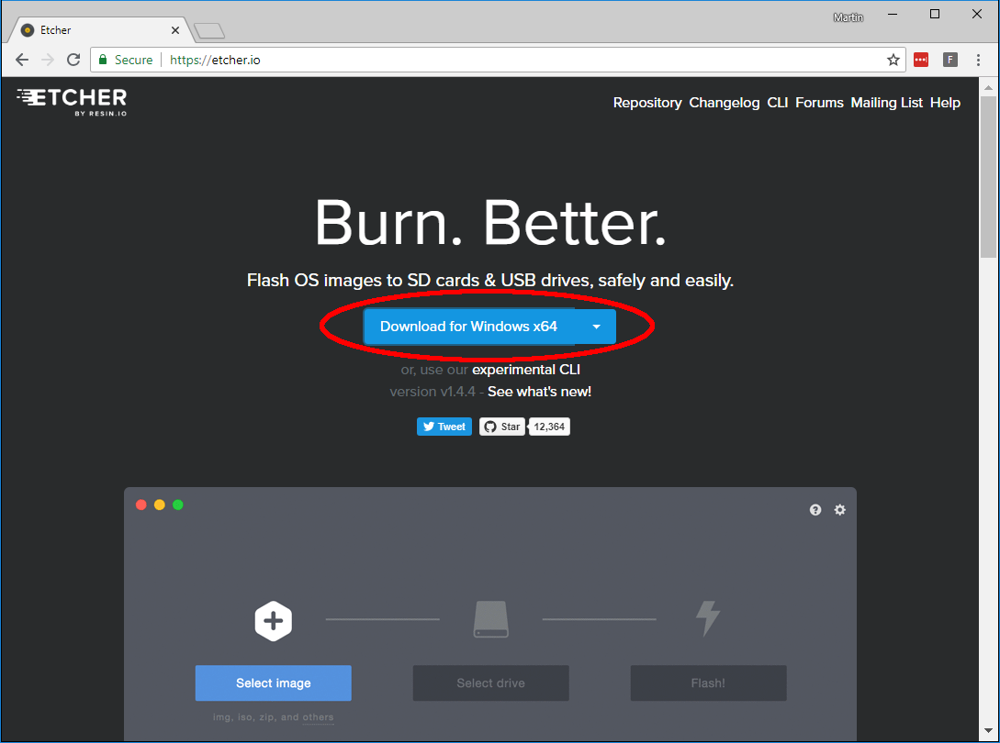
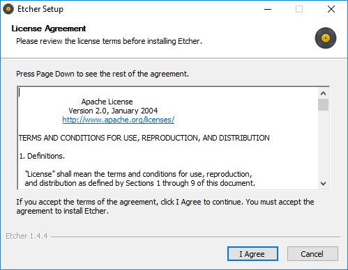
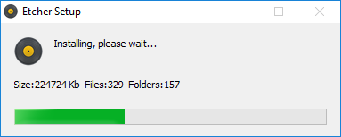
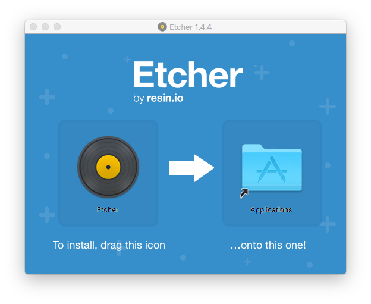

## Create USB drive installer

The USB drive which will hold all the installation files required to setup your computer with Raspbian.

**Warning:** this will delete all of the data on your USB drive, if you need any files on it make sure you have made a backup.

+ Insert the USB drive into your computer.

+ Open Etcher to write the Raspberry Pi Desktop installation to the USB drive.

--- collapse ---

---
title: Need to download and install etcher?
---

+ Download Etcher for your operating system from [etcher.io](https://etcher.io/).

+ Run the installer you downloaded by double clicking it.

### Windows

+ Accept the **License Agreement**.

The installation will run automatically and etcher will open when completed.

### Mac

+ Drag the Etcher icon to the Applications folder.

The installation will run automatically.

+ Open Etcher from Applications.

--- /collapse ---

+ Click **Select Image** and open the *Raspberry Pi Desktop* ISO you downloaded.

+ Check the USB drive selected is the correct one.

**Warning:** selecting the wrong drive will result in the data on it being deleted.

+ Click **Flash** to write the Raspberry Pi Desktop image to your USB drive.

Etcher will show the message **Starting** before showing the **Flashing** progress.

When complete you will see a message saying **Flash Complete**.

