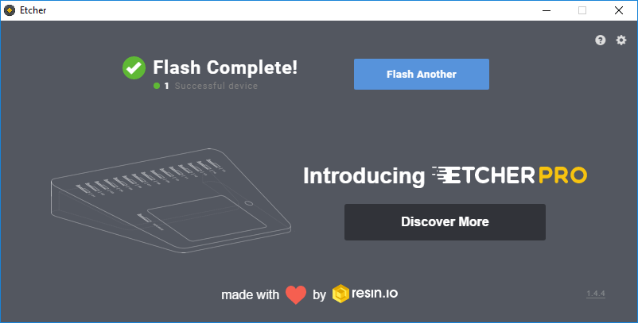

## Create the USB drive installer

The installer is the USB drive that will hold all the installation files required to set up your computer with Raspbian.

**Warning:** setting up a USB drive as an installer will delete all of the data on the drive. If you need any files on it, make sure you have made a backup.

+ Insert the USB drive into your computer.

+ Open the Etcher program to write the Raspberry Pi Desktop installation to the USB drive.

--- collapse ---

---
title: Need to download and install Etcher?
---

+ Download Etcher for your operating system from [etcher.io](https://etcher.io/).

+ Open the installer file you downloaded.

### Windows

+ **Accept** the License Agreement.

The installation will proceed automatically, and when it is complete, the Etcher program will start up.

### Mac

+ Drag the Etcher icon to the **Applications** folder.

The installation will proceed automatically.

+ Open the Etcher program from the **Applications** folder.

### Linux

+ Extract the Etcher AppImage from the `.zip` file.

+ Run the Etcher AppImage installer.

+ Open Etcher from the **Applications** menu.

--- /collapse ---

+ In Etcher, click **Select Image** and open the `Raspberry Pi Desktop` ISO file you downloaded.

+ Select the correct USB drive.

**Warning:** selecting the wrong drive will result in the data on it being deleted.

+ Click **Flash** to write the Raspberry Pi Desktop image to your USB drive.

Etcher will show the message `Starting`, and then it will show the `Flashing` progress.

When the proces is complete, you will see the message `Flash Complete`.

