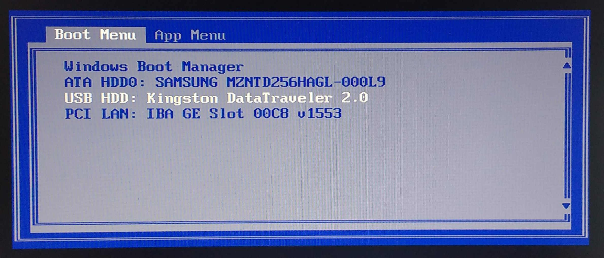
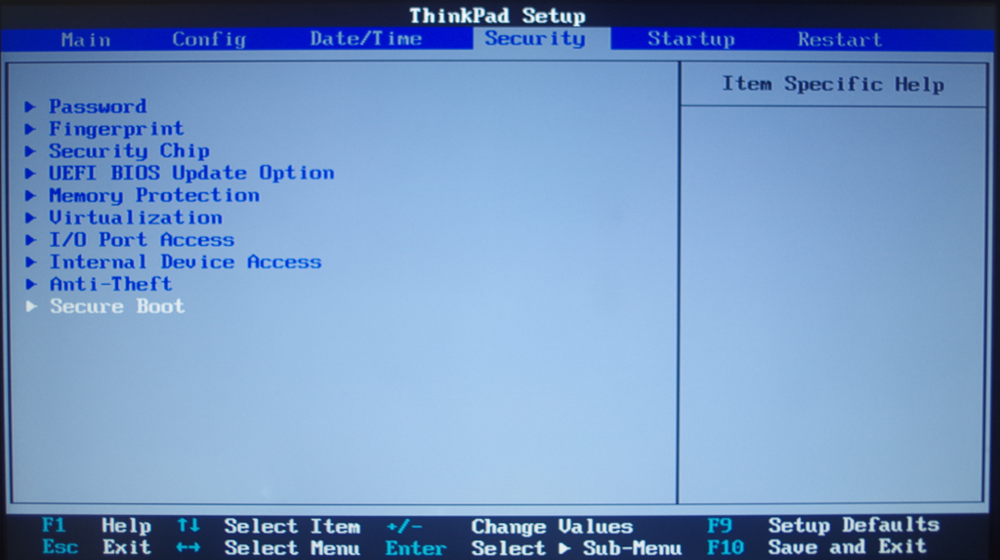
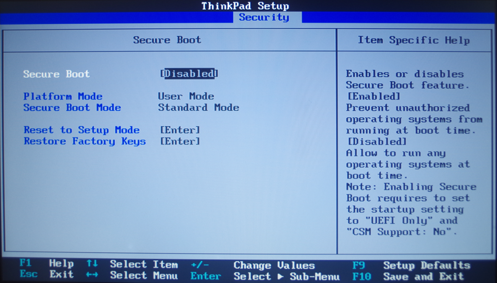

## Boot from the USB drive

To install the Raspberry Pi Desktop from your USB drive installer, you will need to boot your computer from the USB drive.

**Warning:** remember, installing the Raspberry Pi Desktop will delete all the data on your computer. Be sure that you have backed up everything you need before continuing.

To be able to do this, you may need to press a key while the computer is starting up to open the **boot menu** and select **USB**. The key you need to press depends on the make and model of your computer.

You can find out the **boot menu key** of many makes and models of computers at [rpf.io/usb-boot](http://rpf.io/usb-boot).

+ Insert the USB drive installer into the computer.

+ Turn on the computer.

+ As the computer is starting up, press the **boot menu key**. You may need to press it multiple times in order for the menu to appear.

A boot menu will appear that should look similar to this:

+ Select the option for your USB drive, probably called **USB-HDD**, and press <kbd>Enter</kbd>.

--- collapse ---

---
title: Problems with secure boot?
---

Depending on the setup of your computer you may receive a "Secure Boot" error. This is normally due to "Secure Boot" being enabled in the computers BIOS.

To disable "Secure Boot" you will need to enter the BIOS by pressing the bios key while your computer is starting up. 

Again the key you need to press depends upon on the make and model of your computer and you can find out the **bios key** for many computers at [rpf.io/usb-boot](http://rpf.io/usb-boot).

The **Secure Boot** option will usually be found under the "Security", "Advanced" or "Boot" menus in the BIOS, although this maybe different on your computer.

+ Disable **Secure Boot**, save the changes and exit.

+ Boot from the USB drive again.

--- /collapse ---

