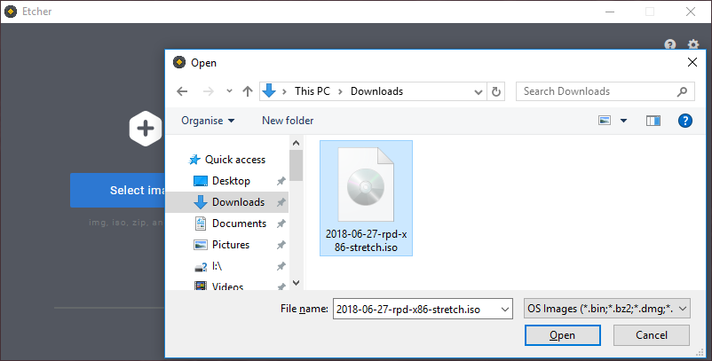
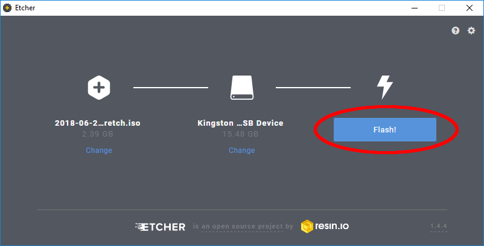
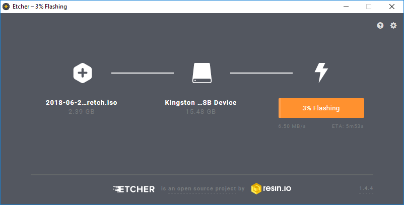

## Create USB Drive Installer

--- task ---

Insert your USB drive into your computer.

--- /task ---

--- task ---

Open Etcher

--- collapse ---

---
title: Download and Install etcher
---

+ Download etcher for your operating system from [etcher.io](https://etcher.io/).

+ Run the installer you 

--- /collapse ---

Click **Select Image** and open the *Raspberry Pi Desktop* ISO you downloaded.

--- /task ---

--- task ---

Check the USB drive you selected is the correct one.

--- /task ---

--- task ---

Click **Flash!** to write the Raspberry Pi Desktop image to your USB drive.

--- /task ---

Etcher will show the message **Starting** before showing the progress.

When complete you will see a message saying **Flash Complete**.

