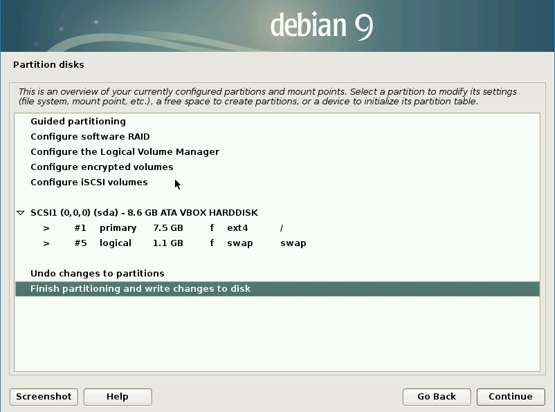
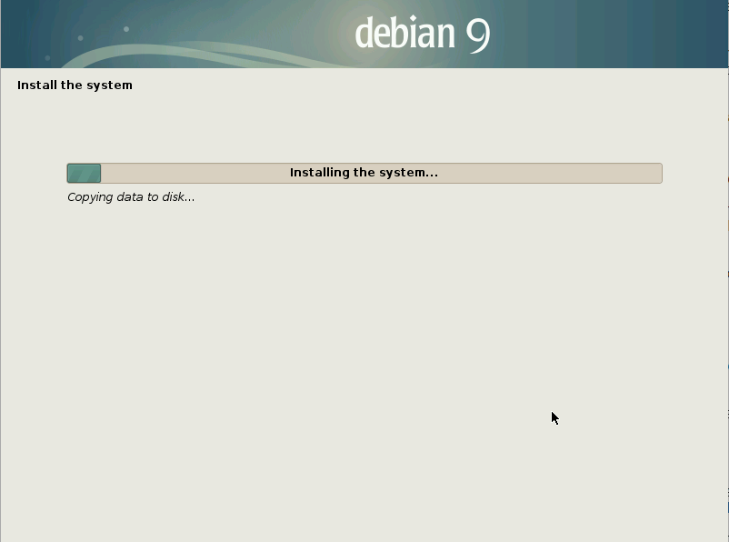

## Run the installation

Now you have a USB drive installer you can use it to install the Raspberry Pi Desktop on a computer. The installer can be used multiple times and once the installation is complete it can be removed from the computer.

**Warning:** this will delete all the data on your computer, be sure you have backed up anything you need before continuing.

### Boot from USB

To install the Raspberry Pi Desktop from your USB installer you will need to boot your computer from USB.

Depending on the setup of your computer you may need to press a key to open the **boot menu** and select USB. The key you need to press will depend on the make and model of your computer but it is likely be a function key.  

You can find the **Boot Menu Key** for many makes and models and computers at [rpf.io/usb-boot](http://rpf.io/usb-boot).

+ Insert the USB drive installer into the computer.

+ Turn on the computer.

+ As the computer is starting press the **Boot Menu Key** - you may need to press it multiple times in order for the menu to appear.

A boot menu will appear which will look similar to this:

+ Select the option for your USB drive, probably labelled **USB-HDD** and press <kbd>Enter</kbd>.

### Install Debian Linux

The Debian install menu will appear.

+ Select `Graphical install` from the Debian GNU/Linux menu.

**Note:** if you do not select 'Graphical install' quick enough the installer will start using the default option, if this happens, turn off the computer and restart it.

+ Select your Keyboard type and click `Continue`.

The installation process will now install media and detect what hardware is present.

+ Set how you want to Partition your hard disk, select `Guided - use entire disk` and click `Continue`.

+ Select the disk to be partitioned, there will be only 1, and click `Continue`.

+ Set the partitioning scheme, select `All files in one partition (recommended for new users)` and click `Continue`.

+ Confirm the partition settings by selecting `Finish partitioning and write changes to disk` and clicking `Continue`.

+ Confirm that you wish to write the changes to the disk by selecting `Yes` and clicking `Continue`.

Debian will now install the operating system.

--- collapse ---

---
title: Need to install the grub boot loader?
---

Depending on the setup of your computer, you may need to install the grub boot loader, if so:

+ Confirm you want to install the GRUB boot loader on a hard disk by selecting Yes and clicking `Continue`.

+ Select the device `/dev/sda` for boot loader installation and click `Continue`.

The installation will now continue.

--- /collapse ---

+ When installation has finished click `Continue`.

When installation completes your computer will automatically reboot and you will be presented with the `GNU GRUB boot screen`

+ Press <kbd>Enter</kbd> to run **Debian GNU/Linux**.