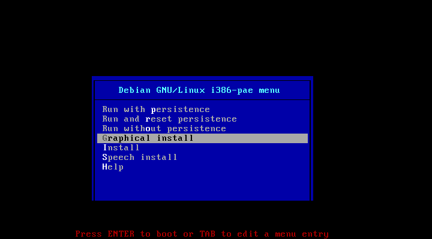
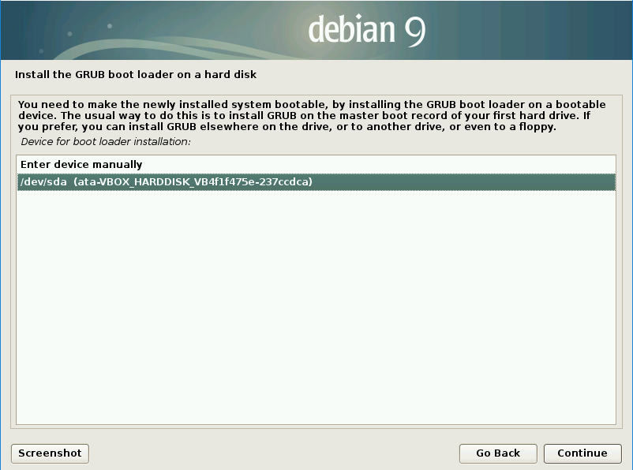
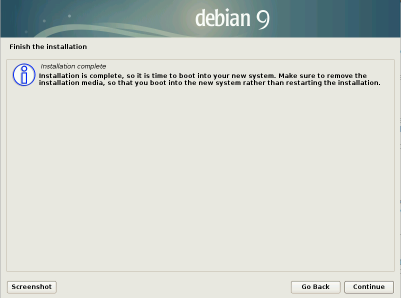
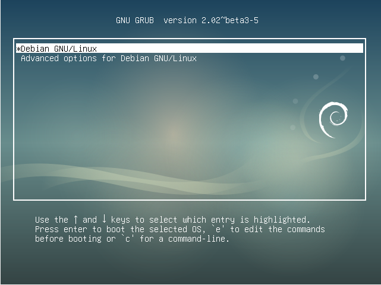

## Run the installation

Now you can use your USB drive installer to install the Raspberry Pi Desktop on a computer.

**Warning:** remember, installing the Raspberry Pi Desktop will delete all the data on your computer. Be sure that you have backed up everything you need before continuing.

### Boot from the USB drive

To install the Raspberry Pi Desktop from your USB drive installer, you will need to boot your computer from the USB drive.

To be able to do this, you may need to press a key while the computer is starting up to open the **boot menu** and select **USB**. The key you need to press depends on the make and model of your computer.

You can find out the **boot menu key** of many makes and models of computers at [rpf.io/usb-boot](http://rpf.io/usb-boot).

+ Insert the USB drive installer into the computer.

+ Turn on the computer.

+ As the computer is starting up, press the **boot menu key**. You may need to press it multiple times in order for the menu to appear.

A boot menu will appear that should look similar to this:

+ Select the option for your USB drive, probably called **USB-HDD**, and press <kbd>Enter</kbd>.

--- collapse ---

---
title: Problems with secure boot?
---

Depending on the setup of your computer you may receive a "Secure Boot" error. This is normally due to "Secure Boot" being enabled in the computers BIOS.

To disable "Secure Boot" you will need to enter the BIOS by pressing the bios key while your computer is starting up. 

Again the key you need to press depends upon on the make and model of your computer and you can find out the **bios key** for many computers at [rpf.io/usb-boot](http://rpf.io/usb-boot).

The **Secure Boot** option will usually be found under the "Security", "Advanced" or "Boot" menus in the BIOS, although this maybe different on your computer.

+ Disable **Secure Boot**, save the changes and exit.

+ Boot from the USB drive again.

--- /collapse ---

### Install Debian Linux

The Debian installation menu will appear.

+ Select **Graphical install** from the **Debian GNU/Linux** menu.

**Note:** if you do not select **Graphical install** quickly enough, the installer will start using the default option. If this happens, turn off the computer, restart it, and boot from the USB drive again as described above.

+ Select your keyboard type and click **Continue**.

The installation process will now install media and detect what hardware is present.

+ To set how you want to partition your hard disk, select **Guided - use entire disk**, and click **Continue**.

+ Select the disk to be partitioned, there maybe more than 1 and click **Continue**.

--- collapse ---

---
title: Which drive to select?
---

You should select your computer's internal drive which is probably the largest drive available.

If you are still unsure, try unplugging all peripherals (external hard drives, printers, sd cards) except your USB drive installer and restarting the installation process.

--- /collapse ---

+ To set the partitioning scheme, select **All files in one partition (recommended for new users)**, and click **Continue**.

+ To confirm the partition settings, select **Finish partitioning and write changes to disk**, and click **Continue**.

+ Confirm that you wish to write the changes to the disk by selecting **Yes** and clicking **Continue**.

The Debian operating system installation will now run.

--- collapse ---

---
title: Need to install the GRUB boot loader?
---

Depending on the setup of your computer, you may need to install the GRUB boot loader. If that's the case, do the following:

+ Confirm you want to install the GRUB boot loader on a hard disk by selecting **Yes** and clicking **Continue**.

+ Select the device `/dev/sda` for boot loader installation, and click **Continue**.

The installation will now continue.

--- /collapse ---

+ When the installation is finished, click **Continue**.

Your computer will automatically reboot and then show you the **GNU GRUB boot screen**.

+ Press <kbd>Enter</kbd> to run **Debian GNU/Linux**.

+ Now that the installation in complete, you can remove the USB drive installer from the computer.
