## Install Raspberry Pi Desktop

After booting from your USB drive installer, the Debian installation menu will appear.

+ Select **Graphical install** from the **Debian GNU/Linux** menu.

**Note:** if you do not select **Graphical install** quickly enough, the installer will start using the default option. If this happens, turn off the computer, restart it, and boot from the USB drive again as described above.

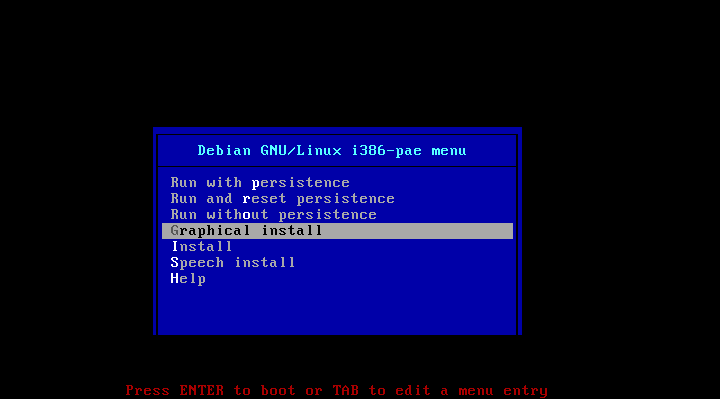

+ Select your keyboard type and click **Continue**.

The installation process will now install media and detect what hardware is present.

+ To set how you want to partition your hard disk, select **Guided - use entire disk**, and click **Continue**.

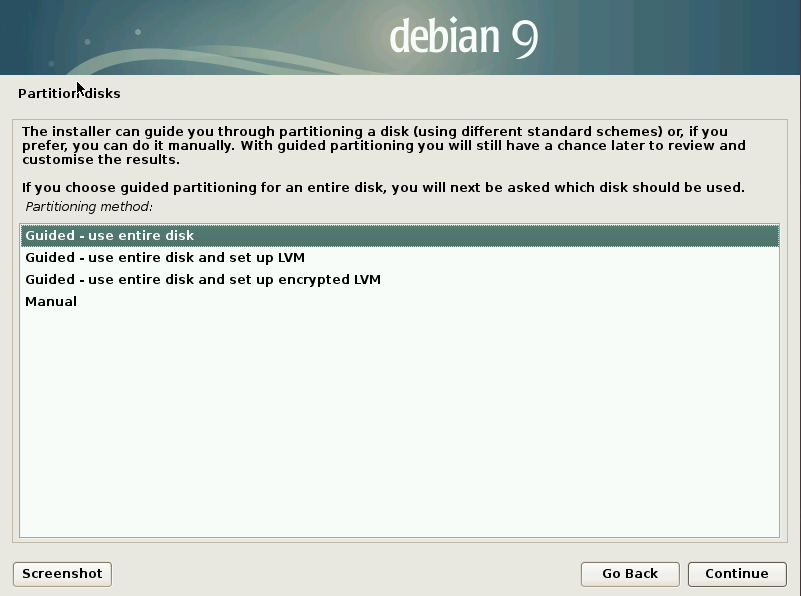

+ Select the disk to be partitioned, there maybe more than 1 and click **Continue**.

--- collapse ---

---
title: Which drive to select?
---

You should select your computer's internal drive which is probably the largest drive available.

If you are still unsure, try unplugging all peripherals (external hard drives, printers, sd cards) except your USB drive installer and restarting the installation process.

--- /collapse ---

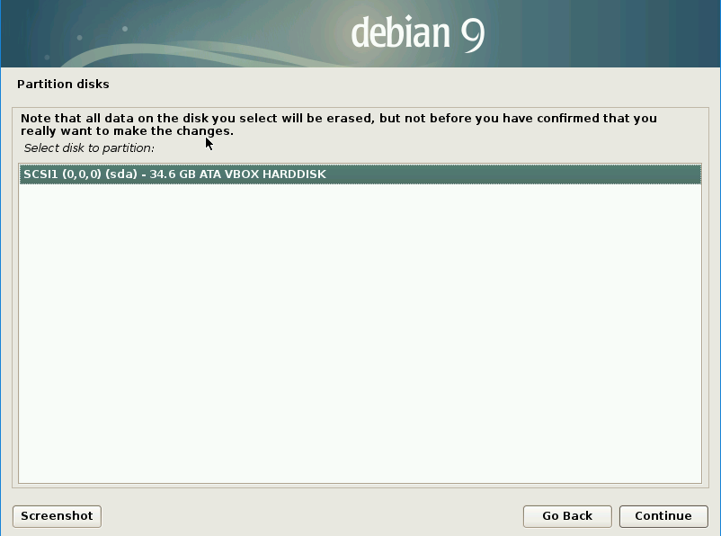

+ To set the partitioning scheme, select **All files in one partition (recommended for new users)**, and click **Continue**.

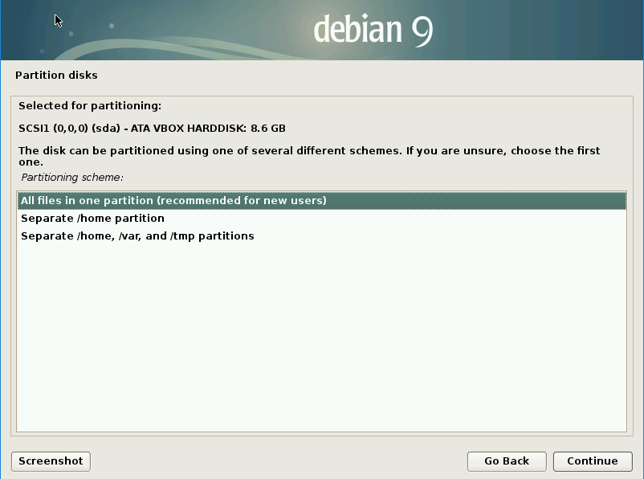

+ To confirm the partition settings, select **Finish partitioning and write changes to disk**, and click **Continue**.

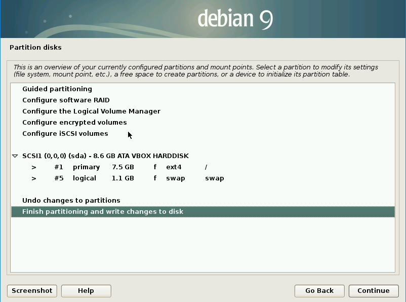

+ Confirm that you wish to write the changes to the disk by selecting **Yes** and clicking **Continue**.

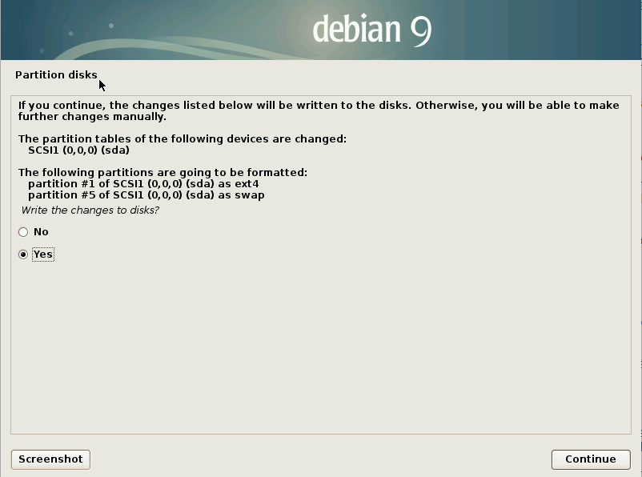

The Debian operating system installation will now run.

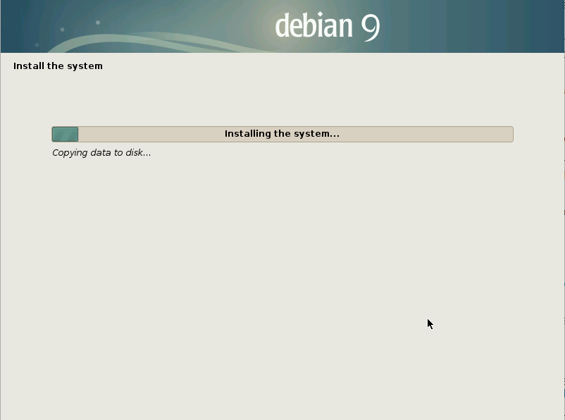

--- collapse ---

---
title: Need to install the GRUB boot loader?
---

Depending on the setup of your computer, you may need to install the GRUB boot loader. If that's the case, do the following:

+ Confirm you want to install the GRUB boot loader on a hard disk by selecting **Yes** and clicking **Continue**.

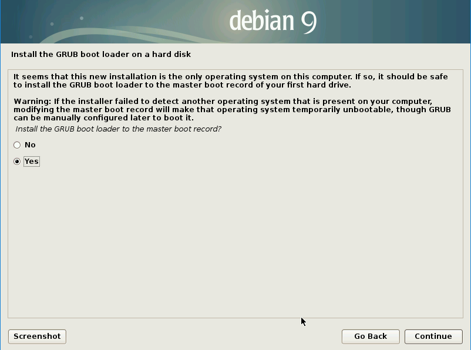

+ Select the device `/dev/sda` for boot loader installation, and click **Continue**.

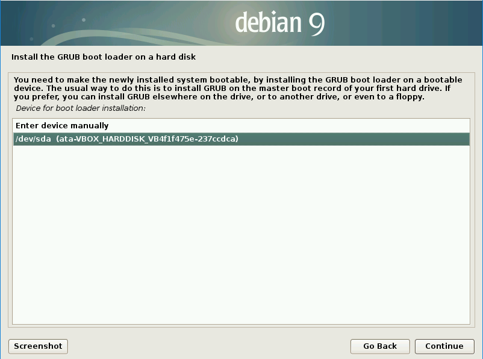

The installation will now continue.

--- /collapse ---

+ When the installation is finished, click **Continue**.

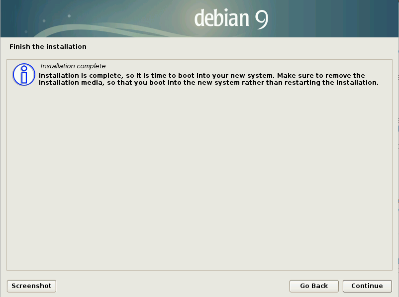

Your computer will automatically reboot and then show you the **GNU GRUB boot screen**.

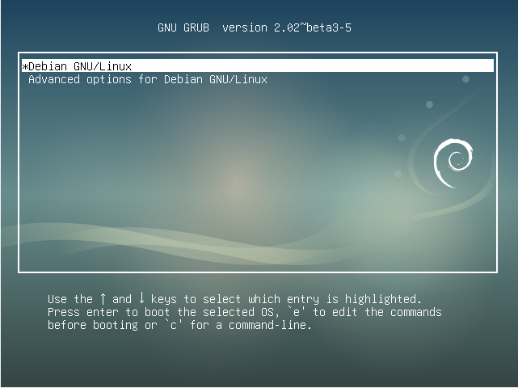

+ Press <kbd>Enter</kbd> to run **Debian GNU/Linux**.

+ Now that the installation in complete, you can remove the USB drive installer from the computer.
