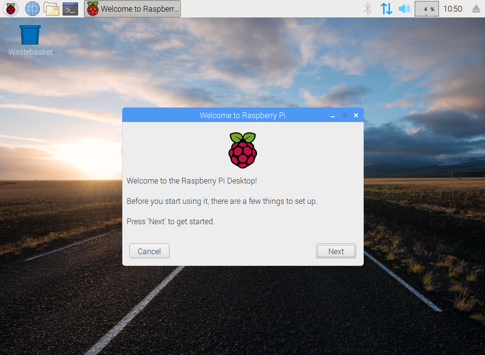
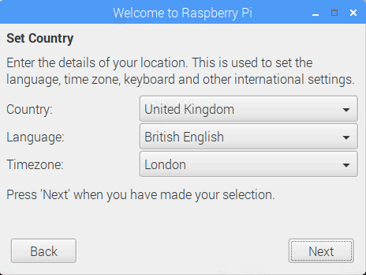
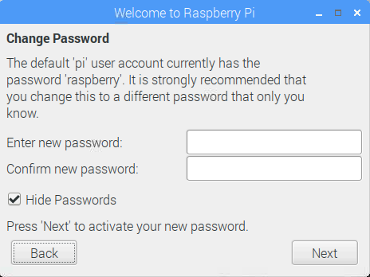
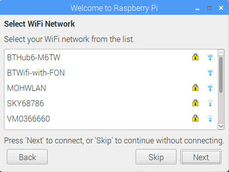
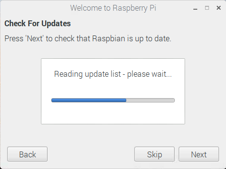
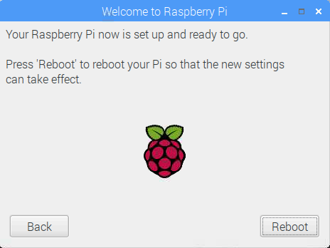

## Starting the Raspberry Pi Desktop

When you start your Raspberry Pi Desktop starts for the first time, the **Welcome to Raspberry Pi** application will pop up and guide you through the initial setup.

+ Click **Next** to start the setup.

+ Set your **Country**, **Language**, and **Timezone**, then click **Next** again.

+ Enter a new password for your Raspberry Pi and click **Next**.

+ Connect to your WiFi network by selecting its name, entering the password, and clicking **Next**.

**Note:** if your computer doesn't have wireless connectivity, you won't see this screen.

+ Click **Next** let the wizard check for updates to Raspberry Pi Desktop and install them (this might take a little while).

+ Click **Done** or **Reboot** to finish the setup.

**Note:** you will only need to reboot if that's necessary to complete an update.

Your Raspberry Pi Desktop is now ready to use.